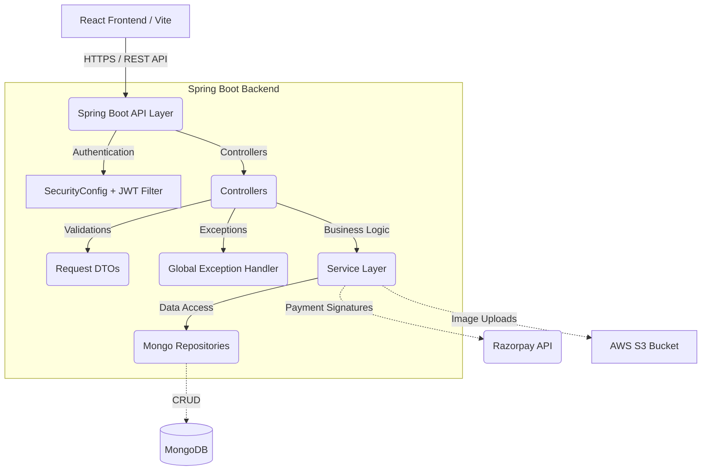

# Full-Stack Food Ordering Platform

 


A fully functional, enterprise-grade food ordering platform built from the ground up to handle real-world scenarios including secure user authentication, shopping carts, cloud image storage, and digital payments.

## 🚀 Key Features

- **Secure Authentication:** JWT-based stateless authentication with password encoding (BCrypt).
- **Payment Gateway Integration:** E2E payment flow using Razorpay, including strict backend **Signature Verification** for webhook security.
- **Cloud Storage:** Image uploads integrated direct-to-cloud via AWS S3.
- **Robust Validation:** Comprehensive request DTO validation (`@Valid`, `@NotBlank`, etc.) and a global `@ControllerAdvice` exception handler.
- **Dynamic Frontend:** Context API-driven React frontend with real-time categorised search filtering.
- **Unit Tested:** Business logic layers covered by JUnit 5 and Mockito tests.

---

## 🏗️ Architecture Design



---

## 🛠️ Technology Stack

**Backend:** Java 17, Spring Boot 3.x, Spring Security, MongoDB Data, AWS SDK, Razorpay Java SDK, Mockito, JUnit 5  
**Frontend:** React (Vite), React Router, Axios, Bootstrap, Context API  
**Cloud & DevOps:** AWS S3, Railway (Backend Deployment), Netlify (Frontend Deployment)

---

## ⚙️ Local Setup Guide

### 1. Backend Setup

1. Navigate to the backend directory:
   ```bash
   cd FoodApp/FoodApp
   ```
2. Configure your environment variables. You must set credentials for MongoDB, AWS S3, and Razorpay:
   ```properties
   spring.data.mongodb.uri=${MONGO_URL}
   aws.accessKeyId=${AWS_ACCESS_KEY}
   aws.secretKey=${AWS_SECRET_KEY}
   jwt.secret=${JWT_SECRET_KEY}
   razorpay.key.id=${RAZORPAY_KEY}
   razorpay.secret.key=${RAZORPAY_SECRET_KEY}
   ```
3. Run the application:
   ```bash
   mvn spring-boot:run
   ```
   *The backend will start on port 8080.*

### 2. Frontend Setup

1. Navigate to the frontend directory:
   ```bash
   cd ClientPanelFooodApp/clientPanel
   ```
2. Check your `.env` config file to point to the backend (Dev or Prod):
   ```env
   VITE_API_BASE_URL=http://localhost:8080/api
   ```
3. Install dependencies and start the Vite dev server:
   ```bash
   npm install
   npm run dev
   ```
   *The application will open on `http://localhost:5173`.*

---

## 🛡️ Security Posture
- **Input Sanitization**: Blocked empty requests at the `Controller` level using Hibernate Validator constraints.
- **No Plaintext Tokens**: Strict logging configurations prevent JWTs or secure HTTP headers from leaking into terminal/file logs.
- **Auth Guards**: Restricted admin-only endpoints (`/api/order/all`, `/api/order/status/**`) strictly behind authenticated scopes.
- **Verified Transactions**: Discarded Razorpay signature trusting in favor of strict `Utils.verifyPaymentSignature()` logic. 
